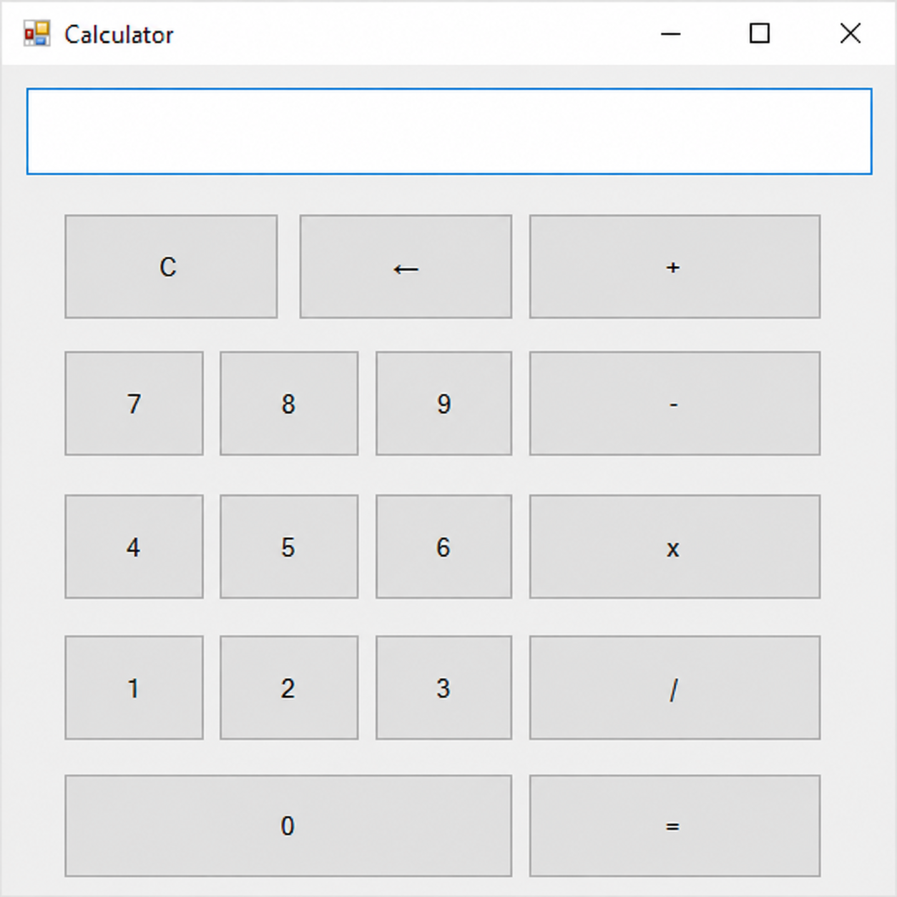

# VB.NET Calculator

Simple calculator application built with Visual Basic .NET using Windows Forms.

## Screenshot

## Features

- Addition (+)
- Subtraction (-)
- Multiplication (×)
- Division (÷)
- Clear button (C)
- Backspace button (←)

## Built With

- Visual Studio 2012
- Visual Basic .NET
- Windows Forms

## How to Run

1. Download the latest release.
2. Extract the ZIP file.
3. Run `Calculator.exe`.

## Author

Arya

GitHub: https://github.com/Arryyaaa27
